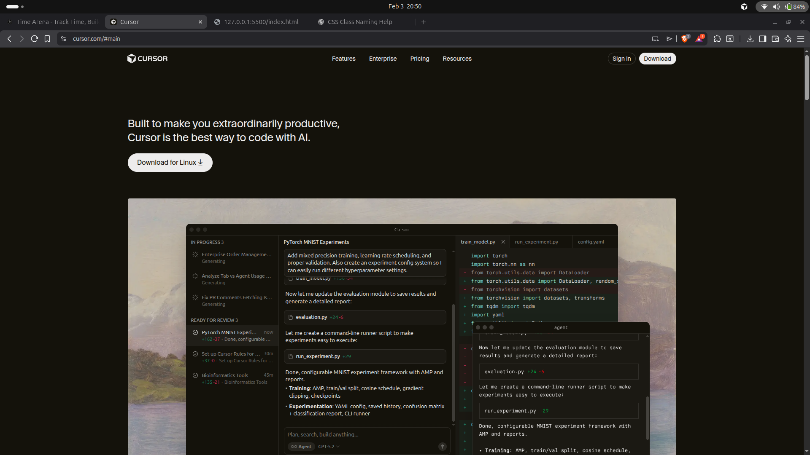

# Cursor Landing Page Clone (HTML & CSS)

This project is a static recreation of the Cursor landing page using only HTML and CSS. The goal was to match the layout, visual hierarchy, and overall look and feel of the original website.

---

## Sections Recreated

The following sections of the Cursor landing page were recreated:

- Header / Navigation  
- Hero Section  
- Social Proof (Trusted by companies)  
- Feature Section 1 – Agent turns ideas into code  
- Feature Section 2 – Autocomplete (Tab)  
- Feature Section 3 – Cursor Ecosystem  
- Testimonials Section  
- Feature Highlights Section  
- Join Us Section  
- Call To Action (CTA)  
- Footer

---

## Fonts & Colors Used

### Fonts
- System font stack with Cursor-style fallback:
  - `CursorGothic`, `CursorGothic Fallback`
  - `system-ui`, `Helvetica Neue`, `Helvetica`, `Arial`, `sans-serif`

### Colors
Defined using CSS variables:

- Background:
  - Primary: `#14120b`
  - Secondary: `#1b1913`
  - Surface: `#1d1b15`
- Text:
  - Primary: `#edecec`
  - Muted: `#9a9996`
- Accent:
  - Orange accent: `#bf4105`

These colors were chosen to closely match the dark theme and accent style of the original Cursor website.

---

## Screenshots (Final Output)

[Hosted here: ]()